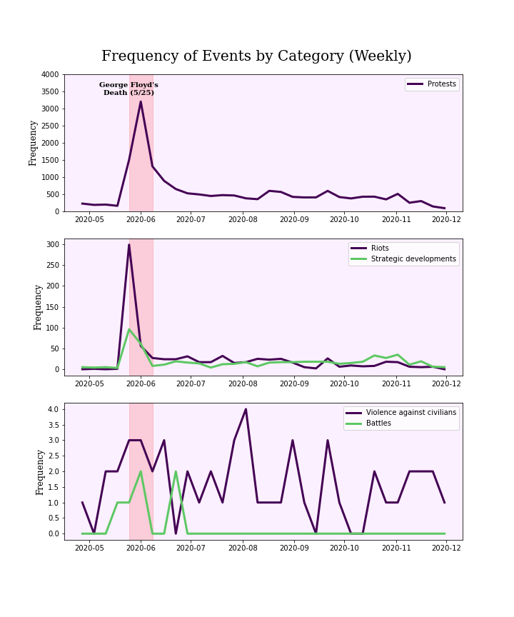
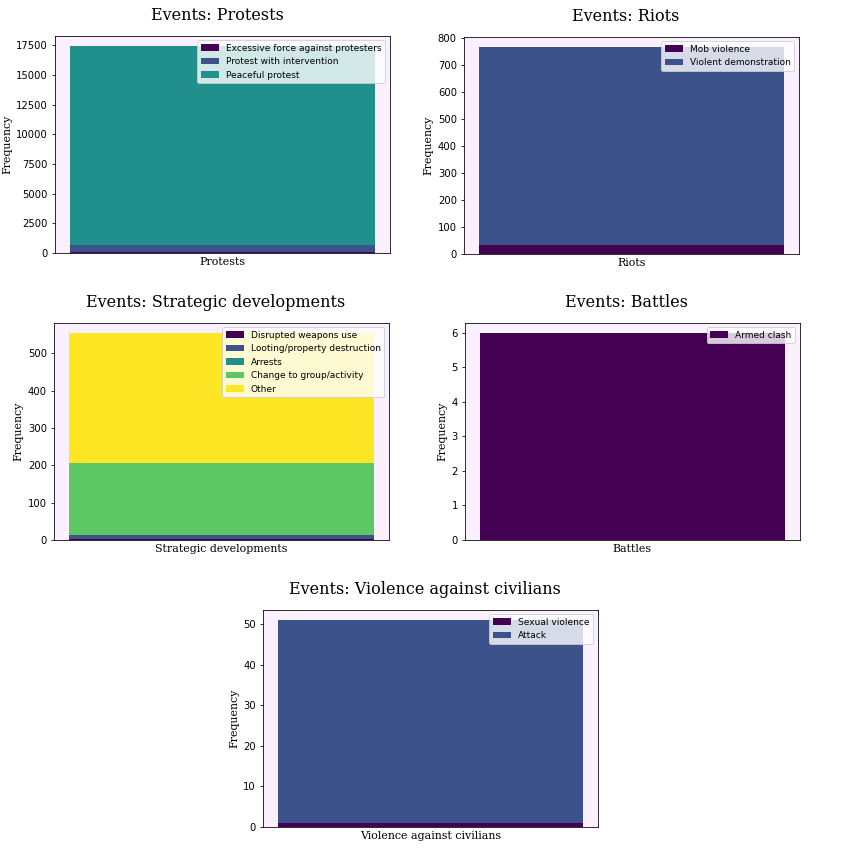

```{r setup, include=FALSE}
library(flexdashboard)
```


### Project Overview and Information {.tabset .tabset-fade .tabset-pills}
-------------------------------------------------------------------------
<h3><b>Important Definitions</b></h3>

<h5><b>Conflict-Driven Events:</b><h5>

A Conflict-Driven Event, in this context, is any event (violent or nonviolent) that is motivated by a political or societal disagreement between those involved, called actors in this project. Events can be one or many groups of actors demonstrating against an organization, establishment, or political institution, or they can be an interaction between two or more groups on opposing sides of an issue.
These Events could be anything from a lawful and peaceful protest to acts of extreme violence.

<h5><b>Actors:</b><h5>

Anyone who is physically involved in the event that took place, meaning they were actually present at the event.

<h5><b>Interactions:</b><h5>

An interaction occurs when two separate groups appear at the same event, either to support the purpose of the event, or as a counter demonstrator to inhibit the actor(s) initiating the event.

<h3><b>Project Navigation</b></h3>

This project will be structured using the "The 5 Ws" of basic information gathering.

What?, Where?, Who?, When?, Why?

My hope and goal is to offer you, as the reader, a more holistic and data-backed view of the conflict events we have seen throughout the United States in 2020.

<h1><b>What type of events?</b></h1>

<h3><b>Events by Category Over Time</b></h3>
```{r,fig.align='center',echo=FALSE}

```
<h3><b>Event Categories Breakdown</b></h3>
```{r,fig.align='center',fig.width=8,fig.height=10,echo=FALSE}

```

<h1><b>Where have events happened?</b></h1>

```{r,message=FALSE,warning=FALSE,echo=FALSE,results=FALSE}
library(rgdal)
library(sf)
library(leaflet)
library(ggplot2)
library(tmap)
library(dplyr)
library(RColorBrewer)
# Read in shapefiles
county<-readOGR("data","UScountyFixed")
state<-readOGR("data","USstateFixed")
acledPts <- readOGR("data","AcledEventPoints")
# Make choropleth Maps (One by counties and weeks, one by counties and total events, and one by states and fatalities)
county$StCnty <- tolower(paste0(county$NAME,", ",county$State))
acledPts$StCnty <- tolower(paste0(acledPts$county,", ",acledPts$state))
county_total <- mutate(acledPts@data) %>%
                  group_by(StCnty) %>%
                  summarise(num_events = n())
county <-merge(county,county_total,
               by="StCnty",all.x=TRUE)
county[is.na(county$num_events),"num_events"] <- 0
state_fats <- mutate(acledPts@data) %>%
                  group_by(state) %>%
                  summarise(num_fats = sum(fatalts))

state <- merge(state,state_fats,by.x="NAME",by.y="state",all.x=TRUE)
state <- subset(state,!(is.na(num_fats)))
```

<h3><b>State Map of the Number of Fatalities (Event related) in US States</b></h3>

```{r,echo=FALSE,fig.width=10,fig.height=5,fig.align="center"}
state$fatLab <- paste0("<strong>",state$NAME,"</strong>","<br>","<strong>Number of Fatalities:</strong>\t",state$num_fats)
fatPal <- colorBin("Reds",state$num_fats,
                   bins = c(0,1,3,5,10,16),right = FALSE)

leaflet(state) %>%
  setView(lng=(-125+(-66))/2,lat=(25+49.4)/2,zoom=4) %>%
  addPolygons(data = state, color="black",weight=1,
              fillColor=~fatPal(num_fats),
              fillOpacity = 0.85,
              label =lapply(state$fatLab,htmltools::HTML),
              highlightOptions = highlightOptions(color = "blue",
                                      weight = 3.5,bringToFront = TRUE)) %>%
  addLegend("bottomright",pal=fatPal, 
            values=~num_fats,opacity = 0.85,
            title="Number of Fatalities 2020")
```

<h3><b>County Map of the Number of Events in US Counties</b></h3>

```{r,echo=FALSE,fig.width=10,fig.height=5,fig.align="center"}
county$eventLab <- paste0("<strong>",county$NAME,", ",
                          county$State,"</strong>","<br>",
                            "<strong>Number of Events:</strong>\t",
                            county$num_events)
eventPal <- colorBin("Reds",county$num_events,c(0,1,10,50,100,500))

leaflet(county) %>%
  setView(lng=(-125+(-66))/2,lat=(25+49.4)/2,zoom=4) %>%
  addPolygons(data = county, color="black",weight=1,
              fillColor=~eventPal(num_events),
              fillOpacity = 0.85,
              label =lapply(county$eventLab,htmltools::HTML),
              highlightOptions = highlightOptions(color = "blue",
                                      weight = 3.5,bringToFront = TRUE)) %>%
  addLegend("bottomright",pal=eventPal, 
            values=~num_events,opacity = 0.85,
            title="Number of Conflict<br>Events 2020")
```

<h1><b>Who has been involved?</b></h1>

```{r, message = FALSE, warning=FALSE,echo=FALSE,results=FALSE}
library(tidyverse)
source("MyRtheme.R")
acld <- read.csv("data/ACLED_Evnts_Prepped.csv")
acld$X <- NULL
# Create Edge and Node List of Interactions
# Edge List
interactions <- acld[acld$inter1!=0&acld$inter2!=0,]
per_inter <- interactions %>%
              group_by(inter1,inter2) %>%
              summarise(weight=n()) %>%
              ungroup()
per_inter$inter1[per_inter$inter1!=1] = per_inter$inter1[per_inter$inter1!=1] -1
per_inter$inter2[per_inter$inter2!=1] = per_inter$inter2[per_inter$inter2!=1] -1
edge_list <- tibble(int_1=per_inter$inter1,int_2=per_inter$inter2,weight=per_inter$weight)

# Node List
node_list <- tibble(id = 1:7,
                    label=c("State Forces","Political Militias",
                            "Identity Militias","Rioters","Protestors",
                            "Civilians","External Forces"))
library(networkD3)
edges_d3 <- mutate(edge_list, int_1 = int_1 - 1, int_2 = int_2 - 1)
nodes_d3 <- mutate(node_list, id = id - 1)
edges_d3 <- edges_d3 %>%
              arrange(desc(weight))
```

<h3><b>Network of Actor Group Interactions</b></h3>

```{r,message=FALSE,warning=FALSE,echo=FALSE,fig.align='center',fig.width=12,fig.height=4}
forceNetwork(Links = edges_d3, Nodes = nodes_d3, Source = "int_1", Target = "int_2", 
             NodeID = "label", Group = "id", Value = "weight", 
             opacity = 0.9, fontSize = 16, zoom = FALSE,
             colourScale = JS("d3.scaleOrdinal(d3.schemeCategory10);"),
             charge=-5000,opacityNoHover = 0.75,linkColour = "silver",
              radiusCalculation = " Math.sqrt(d.nodesize)+20")
```

<h3><b>Sankey Diagram of Interaction Flow</b></h3>
<h5>**Hover over paths to see the number of each type of interaction**</h5>

```{r,message=FALSE,warning=FALSE,echo=FALSE,fig.align='center',fig.width=8,fig.height=4}
sankeyNetwork(Links = edges_d3, Nodes = nodes_d3, Source = "int_1", Target = "int_2", 
              NodeID = "label", Value = "weight",width=800,height=400,
              fontSize = 16, unit = " Interactions",sinksRight = FALSE,iterations=100)
```

<h3><b>Arc Network of Actor Group Interactions</b></h3>

```{r,message=FALSE,warning=FALSE,echo=FALSE,fig.align='center',fig.width=12,fig.height=4}
library(tidygraph)
library(ggraph)

int_tidy <- tbl_graph(nodes = node_list, edges = edge_list, directed = FALSE)

ggraph(int_tidy, layout = "linear") + 
  geom_edge_arc(aes(width = weight), alpha = 0.8) + 
  scale_edge_width(range = c(0.2, 2)) +
  geom_node_text(aes(label = label)) +
  labs(edge_width = "Number of Interactions") +
  ggtitle("Interactions Between Groups in Conflict Events") +
  xlab(" ") + ylab(" ") + 
  mytheme() +
  theme(axis.text.x=element_blank(),
        axis.text.y = element_blank(),
        axis.ticks = element_blank())
```

<h1><b>When have the events taken place?</b></h1>

```{r, message = FALSE, warning=FALSE,echo=FALSE,results=FALSE}
library(tidyverse)
source("MyRtheme.R")
acld <- read.csv("data/ACLED_Evnts_Prepped.csv")
acld$X <- NULL
acld$actJoined <- paste(acld$assoc_actor_1,acld$assoc_actor_2,sep=";")
indActors <- stringr::str_split(acld$actJoined,";")

# Weekly Number of events for different actors

actors <- c()
for(i in 1:length(indActors)){
  for(j in 1:length(indActors[[i]])){
    actors <- append(actors,indActors[[i]][j])
  }
}
actors <- stringr::str_trim(actors,side="both")
actTbl <- table(actors)
top6actors <- names(sort(actTbl,decreasing = TRUE)[2:7])
top5actors <- top6actors[top6actors!="African American Group (United States)"] 
otherActors <- c(names(sort(actTbl,decreasing = TRUE)[8:length(actTbl)]),
                 "African American Group (United States)")

acld$event_date <- as.Date(acld$event_date)
weekly <- seq(from=min(acld$event_date),to=max(acld$event_date),by="week")
biweekly <- seq(from=min(acld$event_date),to=max(acld$event_date),by="2 week")
weeklySums <- function(from,to,df,top5){
  week <- df[(df$event_date>=from)&(df$event_date<to),]
  total <- nrow(week)
  indActors <- stringr::str_split(week$actJoined,";")
  actors <- c()
  for(i in 1:length(indActors)){
    for(j in 1:length(indActors[[i]])){
      actors <- append(actors,indActors[[i]][j])
    }
  }
  tbl <- table(actors)
  top5_counts <- c()
  for(name in top5){
    top5_counts <- append(top5_counts,tbl[name])
  }
  x <- data.frame(top5_counts[!(is.na(top5_counts))])
  names(x) <- c("Num_Events")
  missing <- top5[!(top5 %in% row.names(x))]
  missingdf <- data.frame(rep(0,length(missing)),row.names = missing)
  names(missingdf) <- c("Num_Events")
  x <- rbind(x,missingdf)
  other <- total - sum(x$Num_Events)
  otherdf <- data.frame(other,row.names="All Unlisted Actors")
  names(otherdf) <- c("Num_Events")
  x <- rbind(x,otherdf)
  return(x)
}
x5 <- c()
for(i in 2:length(weekly)){
  x5 <- append(x5,weeklySums(weekly[i-1],weekly[i],acld,top5actors))
}

y5<- data.frame(matrix(nrow=length(weekly)-1,ncol=(length(top5actors) + 1)))
names(y5) <- c(top5actors,"All Unlisted Actors")
for(i in 1:length(x5)){
  y5[i,] <- x5[[i]]
}
y5$date <- weekly[2:length(weekly)]
y5_vals <- data.frame(y5)
y5$total_events <- rep(0,nrow(y5))

for(i in 1:nrow(y5)){
  y5$total_events[i] <- sum(y5[i,1:(ncol(y5)-2)])
  y5[i,1:(ncol(y5)-2)] <- y5[i,1:(ncol(y5)-2)]/sum(y5[i,1:(ncol(y5)-2)])
}

dates5 <- rep(y5$date,length(top5actors) + 1)
tot_events5 <- rep(y5$total_events,length(top5actors) + 1)
actor_names5 <- c(rep(names(y5)[1],length(y5$date)),rep(names(y5)[2],length(y5$date)),
                 rep(names(y5)[3],length(y5$date)),rep(names(y5)[4],length(y5$date)),
                 rep(names(y5)[5],length(y5$date)),rep(names(y5)[6],length(y5$date)))
vals5 <- c(y5[,1],y5[,2],y5[,3],y5[,4],y5[,5],y5[,6])
plot5DF <- data.frame(dates5,actor_names5,vals5,tot_events5)
```

<h3><b>Stacked Area Plot of the Proportions of Events from Top 4 Actors Based on Number of Events</b></h3>

```{r,message=FALSE,warning=FALSE,echo=FALSE,fig.width=9,fig.height=5,fig.align='center'}
library(ggplot2)
library(plotly)
plot5DF$actor_names5 <- gsub(" \\(United States\\)","",plot5DF$actor_names5)
plot5DF$actor_names5 <- factor(plot5DF$actor_names5,
                        levels = c("All Unlisted Actors","BLM: Black Lives Matter",
                                   "Pro-Police Group","Labour Group",
                                   "Students","Teachers"))

plot5DF$num_events5 <- ceiling(plot5DF$tot_events5*plot5DF$vals5)
ap <- ggplot(plot5DF, aes(x=dates5, y=vals5*100, fill=actor_names5,text=actor_names5)) +
  geom_area() + 
  xlab("Date") + ylab("Percentage of Events (Weekly)") + 
  ggtitle("Weekly Top 5 Actors in US Conflict Events") +
  scale_y_continuous(labels = function(x) paste0(x, "%")) + 
  scale_fill_viridis_d(name=" ") +
  mytheme()

ggplotly(ap,tooltip="text")
```

```{r,message=FALSE,warning=FALSE,echo=FALSE,results=FALSE}
top15actors <- names(sort(actTbl,decreasing = TRUE)[3:17])
otherActors <- c(names(sort(actTbl,decreasing = TRUE)[18:length(actTbl)]))
x15 <- c()
for(i in 2:length(biweekly)){
  x15 <- append(x15,weeklySums(biweekly[i-1],biweekly[i],acld,top15actors))
}

y15<- data.frame(matrix(nrow=length(biweekly)-1,ncol=(length(top15actors) + 1)))
names(y15) <- c(top15actors,"Other Actors")
for(i in 1:length(x15)){
  y15[i,] <- x15[[i]]
}
y15$date <- biweekly[2:length(biweekly)]
y15_vals <- data.frame(y15)
y15$total_events <- rep(0,nrow(y15))

for(i in 1:nrow(y15)){
  y15$total_events[i] <- sum(y15[i,1:(ncol(y15)-2)])
  y15[i,1:(ncol(y15)-2)] <- y15[i,1:(ncol(y15)-2)]/sum(y15[i,1:(ncol(y15)-2)])
}

dates15 <- rep(y15$date,length(top15actors) + 1)
tot_events15 <- rep(y15$total_events,length(top15actors) + 1)
actor_names15 <- c()
vals15 <- c()
for(i in 1:(ncol(y15)-2)){
  actor_names15 <- append(actor_names15,rep(names(y15)[i],length(y15$date)))
  vals15 <- append(vals15,y15[,i])
  }
plot15DF <- data.frame(dates15,actor_names15,vals15,tot_events15)

```

<h3><b>Line Chart Depicting the Number of Events of the Actors Ranking 5-20 Based on Number of Events</b></h3>

```{r,message=FALSE,warning=FALSE,echo=FALSE,fig.width=9,fig.height=5,fig.align='center'}
library(dygraphs)
library(xts)
library(lubridate)
library(magrittr)
new_names15 <- gsub("\\.\\.United\\.States\\.","",names(y15_vals))
new_names15 <-gsub("\\.\\.2017\\.\\.","",new_names15)
new_names15 <-gsub("\\.\\.National\\.Association\\.for\\.the\\.Advancement\\.of\\.Colored\\.People","",new_names15)
names(y15_vals) <- new_names15
don15 <- xts(x = y15_vals[,1:15], order.by = y15_vals$date)

dyCSScool <- function(dygraph){
  
  dygraph$x$css <- '
  .dygraph-legend {
  width: auto !important;
  color: white;
  background-color: #BABABA !important;
  padding-left:5px;
  border-color:#BABABA;
  border-style:solid;
  border-width:thin;
  transition:0s 4s;
  z-index: 80 !important;
  box-shadow: 2px 2px 5px rgba(0, 0, 0, .3);
  border-radius: 3px;
  }
  
  .dygraph-legend > span {
  color: black;
  font-size:10px;
  padding-left:5px;
  padding-right:2px;
  margin-left:-5px;
  background-color: white !important;
  display: block;
  }
  
  .dygraph-legend > span > span{
  display: inline;
  }
  
  .highlight {
  border-left: 2px solid #BABABA;
  padding-left:3px !important;
  }
  
  '
  dygraph
}

# Finally the plot

getMonthDay <- 'function(d) {
  var monthNames = ["Jan", "Feb", "Mar", "Apr", "May", "Jun","Jul", "Aug", "Sep", "Oct", "Nov", "Dec"];
  var date;
  if (typeof d == "number") { // value
    date = new Date(d);
  } else { // label
    date = new Date(d.toString().substring(0, 15));
  }
  date.setDate(date.getDate());
  return monthNames[date.getMonth()] + ". " + date.getUTCDate();
}'

p <- dygraph(don15) %>%
  dyRangeSelector() %>%
  dyAnnotation("2020-07-05", text = "A",
               tooltip = "Rise of 'Defund the Police' Slogan/Concept") %>%
# Google Trends evidence:
# https://trends.google.com/trends/explore?geo=US&q=defund%20the%20police
  dyAnnotation("2020-08-02", text = "B",
               tooltip = "School openings begin in many U.S. school districts") %>%
# Source:
# https://www.today.com/parents/when-will-school-open-here-s-state-state-list-t179718
    dyAnnotation("2020-09-27", text = "C",
               tooltip = "Global Climate Strike and Scholar Strike") %>%
# Sources:
# https://globalclimatestrike.net/, https://www.scholarstrike.com/
      dyAnnotation("2020-10-25", text = "D",
               tooltip = "Appointment of Conservative Supreme Court Justice (Sparked fear of losing Abortion Rights, LGBTQ+ Rights, etc.)") %>%
# Sources:
# https://www.washingtonpost.com/politics/2020/10/22/amy-coney-barrett-is-one-most-conservative-appeals-court-justices-40-years-our-new-study-finds/
  dyHighlight(highlightSeriesOpts = list(strokeWidth = 2)) %>%
  dyLegend(width = 700) %>%
  dyAxis(
    "x",
    valueFormatter = htmlwidgets::JS(getMonthDay),
    axisLabelFormatter = htmlwidgets::JS(getMonthDay),
    rangePad = 40
  )  %>%
  dyCSScool()
p
```

<h1><b>Why have these events been happening?</b></h1>

<h3><b>Stacked Bar of the Distribution of Common Topics for Event Descriptions by Month</b></h3>

```{r, message = FALSE, warning=FALSE,echo=FALSE,results=FALSE}
library(tidyverse)
acld <- read.csv("data/ACLED_Evnts_Prepped.csv")
acld$X <- NULL

library(tm)
library(topicmodels)
library(reshape2)
library(pals)
library(ggplot2)
source("MyRtheme.R")
acld$doc_id <- 1:nrow(acld)
acld$text <- acld$notes
acld$description <- acld$sub_event_type
acld$event_date <- as.Date(acld$event_date)
english_stopwords <- readLines("https://slcladal.github.io/resources/stopwords_en.txt",
                                 encoding = "UTF-8")
english_stopwords <- append(english_stopwords,
                            c("dozen","sizedozens","gather","people","size",
                              "sizeno","report","man","group","january",
                              "february","march","april","may","june","july",
                              "august","september","october","november",
                              "december","sizeabout","sizehundreds",
                              "demonstration","protest","california","york",
                              "texas","north","carolina","city","florida",
                              "protester","member","county","hold","tennessee",
                              "call"))

textdata <- acld[,c("doc_id","text","event_date","description")]
corpus <- Corpus(DataframeSource(textdata))
  
# Convert all to lower case
processedCorpus <- tm_map(corpus, content_transformer(tolower))
# Strip Punctuation
processedCorpus <- tm_map(processedCorpus, removePunctuation,
                            preserve_intra_word_dashes = TRUE)
# Remove Numbers
processedCorpus <- tm_map(processedCorpus, removeNumbers)
# Lemmatize
processedCorpus$content <- textstem::lemmatize_strings(processedCorpus$content)
# Remove Whitespace
processedCorpus <- tm_map(processedCorpus, stripWhitespace)
# Remove Stopwords
processedCorpus <- tm_map(processedCorpus, removeWords, english_stopwords)

minFreq <- 5
DTM <- DocumentTermMatrix(processedCorpus, 
                          control=list(bounds=list(global=c(minFreq, Inf))))
sel_idx <- slam::row_sums(DTM) > 0
DTM <- DTM[sel_idx, ]
textdata <- textdata[sel_idx, ]

k <- 4
topicModel <- LDA(DTM,k,method="Gibbs",
                  control=list(burnin=100,iter=600,alpha=1))

tmResult <- posterior(topicModel)
beta <- tmResult$terms
theta <- tmResult$topics
topTermsPerTopic <- terms(topicModel,10)
topicNames <- apply(topTermsPerTopic,2,paste,collapse=" ")
temp <- strsplit(topicNames,split="(?=(?>\\s+\\S*){5}$)\\s",perl=TRUE)

for(i in 1:length(topicNames)){
  temp2 <- paste(temp[[i]][1],temp[[i]][2],sep = "\n")
  topicNames[i] <- paste(temp2,"\n",sep="")
  }
textdata$month <- substr(as.character(textdata$event_date),6,7)
topic_proportion_per_month <- aggregate(theta,by=list(month=textdata$month),
                                        mean)
colnames(topic_proportion_per_month)[2:(k+1)] <- topicNames
vizDataFrame <- melt(topic_proportion_per_month, id.vars = "month")
```

```{r,fig.align="center",fig.height=6,fig.width=10,echo=FALSE}
ggplot(vizDataFrame, aes(x=month, y=value, fill=variable)) + 
  geom_bar(stat = "identity") + ylab("Proportion") + xlab("Month") +
  scale_fill_viridis_d(name = "Top Words in Topic") +
  ggtitle("Monthly Topic Distribution of\nEvent Descriptions in 2020") +
  mytheme()
```