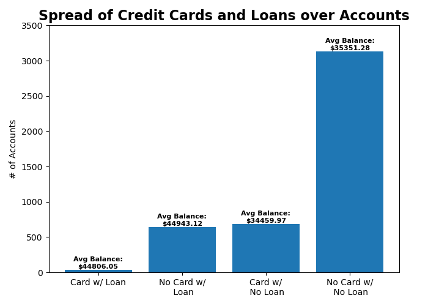

```{r setup, include=FALSE}
library(knitr)  
library(reticulate)  
knitr::knit_engines$set(python = reticulate::eng_python)
```

```{python,results=FALSE,eval=FALSE}
import pandas as pd
import matplotlib.pyplot as plt

acnts = pd.read_csv("data/accounts_analytical.csv")
trscs = pd.read_csv("data/transactions.csv")
avgBal = trscs.groupby("account_id").agg("mean")\
                .reset_index().loc[:,["account_id","balance"]]
avgBal.loc[:,"account_id"] = avgBal.loc[:,"account_id"].astype(int)
new_a = pd.merge(acnts,avgBal,on = "account_id")
new_a.loc[:,"avg_balance"] = new_a.balance
new_a = new_a.drop(columns="balance")

for i in range(len(new_a)):
  if str(new_a.loc[i,"credit_cards"]) != "nan":
    new_a.loc[i,"c_card"] = "Y"
  else:
    new_a.loc[i,"c_card"] = "N"
  if str(new_a.loc[i,"loan_amount"]) != "nan":
    new_a.loc[i,"loan"] = "Y"
  else:
    new_a.loc[i,"loan"] = "N"
    
new_a.to_csv("data/new_aa.csv")
```

```{python,eval=FALSE}
bars = ["Card w/ Loan", "No Card w/\n Loan",
        "Card w/\n No Loan","No Card w/\n No Loan"]
counts = [len(new_a.loc[(new_a.c_card=="Y")&(new_a.loan == "Y"),:]),
           len(new_a.loc[(new_a.c_card=="N")&(new_a.loan == "Y"),:]),
           len(new_a.loc[(new_a.c_card=="Y")&(new_a.loan == "N"),:]),
           len(new_a.loc[(new_a.c_card=="N")&(new_a.loan == "N"),:])]
avgBal = [round(new_a.loc[(new_a.c_card=="Y")&(new_a.loan == "Y"),
                    "avg_balance"].mean(),2),
          round(new_a.loc[(new_a.c_card=="N")&(new_a.loan == "Y"),
                     "avg_balance"].mean(),2), 
          round(new_a.loc[(new_a.c_card=="Y")&(new_a.loan == "N"),
                     "avg_balance"].mean(),2),
          round(new_a.loc[(new_a.c_card=="N")&(new_a.loan == "N"),
                     "avg_balance"].mean(),2)]
bar = plt.bar(bars,counts)
i = 0
for rect in bar:
    height = rect.get_height()
    plt.text(rect.get_x() + rect.get_width()/2.0,
             height, "Avg Balance:\n$"+str(avgBal[i]),
             ha = "center",va = "bottom",
             fontsize=8,fontweight="bold")
    i += 1
plt.ylabel("# of Accounts")
plt.ylim(0,3500)
plt.title("Spread of Credit Cards and Loans over Accounts", fontweight="bold", fontsize = 16)
plt.tight_layout()
plt.savefig("images/task_1_plot.png")
```
```{r,out.height="20%",out.width="65%",echo=FALSE}

```

